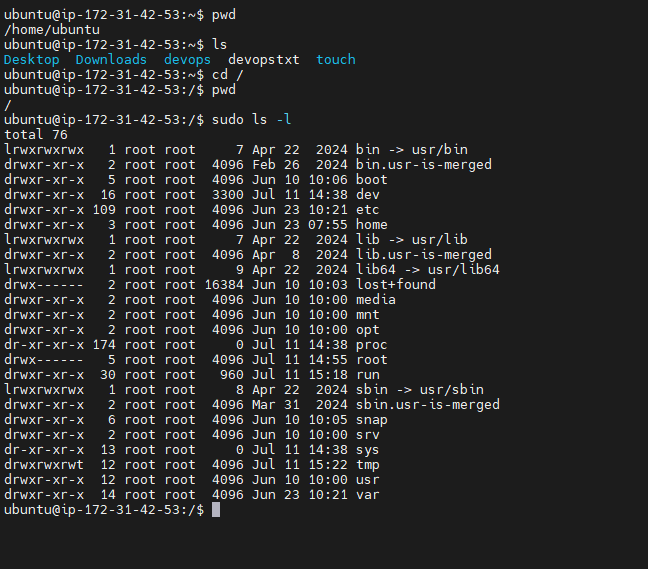

# Linux-Command-Deep-Dive
 Here in this project we dive into deep knowledge of Linux commands.
 We start by defining what a linix command is.
 ## What is a Linux Command?
  A Linux command refers to a program or utility that runs in the command line interface (CLI). The CLI is a text-based environment where you interact with the system by typing commands.
  The general syntax of a linux command is as follows:
  CommandName [option(s)] [parameter(s)]

CommandName: Represents the action or task you want to perform using the command. For example if you want to list files in a folder, you basically use the 'ls' command.
Option or Flag: An option modifies the behavior of a command. It is typically preceded by a hyphen (-) or double hyphen(--) and can be used to customize the command's functionality. e.g, if i want to show extra information for each listed file, i will run the command 'ls -l'.
Parameter or Argument: A parameter provides specific information or data required by the command to execute the desired action. e.g, if i want to create a new folder, i will use the 'mkdir' command. The papramter will be the name of the folder in which i will pass to it i.e 'mkdir photos' will create a photos folder.

## Manipulating Files and Directories on Linux
The 'sudo' command
In Linux, some actions need special permission to be carried out, like creating files in certain areas or changing important system settings. This is where the sudo command comes into play. "sudo" stands for "superuser do" and t allows you to run commands with the security privileges of another user, typically the superuser or "root".
###     Creating a Folder with sudo
1. Opened terminal and connected to Lnux server using SSH
2. I tried creating a folder in a restricted locaton. for example i tried creatng a folder named "example" n the '/root' directory, whch is reserved for the root user wth command below:
mkdir /root/example
the result is as listed below

3. It shows permission denied error
4. Creating folder using sudo with command shown below:
sudo mkdir /root/example
Because 'sudo' is included in the cammand, it was executed successfully. results is as shown below

Folder was created without any error.
 To verify this and to view the folder created the command below was used:
 sudo ls /root
Attached below is the img of the folder created listed with other folders

We go into another command which is the:
### pwd command.
'pwd' command is used to find path of your current working area/ directory.
Using the 'pwd' command on the terminal would go like ths:
pwd
/Users/dareyio/Desktop

The above img shows the result of the pwd command, showing the current path of the directory.
 
### 'cd' command
To navigate through the Linux files and directories, we use the 'cd' command.
but when navigating the root file system we have to use the sudo along side the cd command to get access to the file if we would get an error message.
i ran the command below to access the root file system:
sudo cd /
to confirm pwd command was used

To list the files and directories on in the root file system, these command below was used
sudo ls -l
below is my output

 Then navigated to 'usr' using command below
 sudo cd /usr
 then started with the side Hustle Task 1 :
 1. Creating a directory called 'photos' inside the '/usr'
 command used create the folder is:
 sudo mkdir photos
 img below show the results of the command
 
 2. Navigated into the 'photos' directory using command:
 cd photos.
 3. Created 3 more directories inside the photos directory using command:
 sudo mkdir folder1 folder2 folder3
 The img below shows the image of the created folders
 
 4. Navigated into one of the created file using command:
 cd folder1
 5. then i show the full path of where i am currently as seen in the img below
 

 ### ls Command
  The 'ls' command lists files and directories.
  To see directories content, i typed 'ls' followed by the desired path.
  An example was done to view files in the Documents folder.
  command used was :
  ls /home/ubuntu/Documents
  Here are some options you can use with the ls command:
  ls -R (lists all the files in the subdirectories).
  
 ls -a (shows hidden files in 
 addition to the visible ones).
 
 ls -lh (shows the file sizes in easily readable formats, such as MB, GB, and TB).
 
 
 ### Cat Command
 'Concatenate', or 'cat', is one of the most frequently used Linux commands. it lists, combines and writes file content to the standard output.
 For example i ran a cat following the example given which is:
 sudo cat /etc/os-release
 below is the image of the command ran
 

 ### Cp Command
  Use the 'cp' command to copy fles or directories and their content
  To copy one file from the current directory to another, using command below
  cp devopstxt /home/ubuntu/Documents
  below is the img showing the function
  
 To copy multiple files to a directory, these following command below shows it:
 cp devops1 devops2 devops3 /home/username/Documents
 The img below shows the result of command ran
 
 To copy content of a file to a new file in the same directory, the command below was ran:
 cp devops1 devops2
 The img below shows the result of command ran successfully
 
 To copy an entire directory, pass the -R flag before typing the source directory, example of the command ran is shown below:
 cp -R /home/username/Documents /home/username/Documents_backup
The img below shows the result of command ran successfully

 ### mv command
 The primary use of the mv command is to move and rename files and directories.
 For example i moved a file to a document folder using the command below:
 mv devopstxt /home/ubuntu/Documents
 the output img is shown below:
 

 To also rename a file i used same command in the format below:
 mv devopstxt devops1
 result of the output is shown below:
 

 ### rm command
 The rm command is used to delete files within a directory.
 To remove a single file, the command below is used:
 rm devopstxt
 the output is shown below:
 
 To remove multiple files, these following command was used:
 rm devops1 devops2 devops3
 the output is shown below:
 
 Other flags was added as examples for the rm command e.g:
 -i prompts system confirmation before deleting the file (denotes "interractive"). command used is shown below:
 rm -i devops1
 the output is shown below:
 
 -f allows the system to remove without a confirmation (denotes "force")
 command used is shown below:
 rm -f devops2
 the output is shown below:
 
 -r deletes files and directories recursively.
 command used is shown below:
 rm -r devops3
 the output is shown below:
 

 ### Touch command
 The touch command allows you to create an empty file.
 For example the command below is used to create an HTML file named Web in the Documents directory:
 touch /home/ubuntu/Documents/Web.html
 the output is shown below:
 

 ### Find command
 find command is used to search for files within a specific directory and perform subsequent operations
 for example the command used below is used to find a file in the home directory:
 find /home -name notes.txt
 

These comes to the end of my Linux Command Deep Dive Project. thanks for your time.